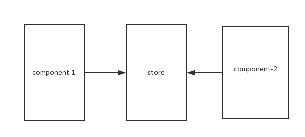
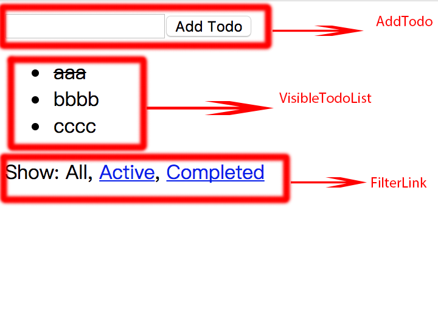

 
# Learn redux step by step

源码地址: git clone -b redux-simulation https://github.com/wangzhengquan/react-redux-tpl

为更好理解redux,这个项目时里用到的store provider combineReducers 是模拟redux实现的。

1. why redux   
 

react组件之间的通信可以通过父子组件之间的props传递，没有父子组件关系的的兄弟组件可以间接的通过父组件传递。那么既不是父子关系也不是兄弟关系的组件如何通信？
 					
页面切换时数据丢失，需要重新拉取，怎么办？
  
   <center>（图1）</center>
    
redux是通过中间的store实现组件的数据存储和访问,每个react组件都可以访问sotre这样就解决了react组件之间的通信问题和数据维护问题。


但是另一个问题来，react在执行setState更新数据时都会更新页面。那么更新store的数据如何通知页面做更新？


<center>（图2）</center>
 
2\. redux工作流程
   
   * 组件在在commponentDidDount的时候，通过store的subscribe方法注册事件
   * 组件要想更新store的数据必须dispatch一个action,通知store执行reducer更新数据，store执行所有注册的监听函数通知组件更新页面


<center>（图3）</center>
   
3\. 认识redux中的几个概念（action、 reducer、 store）
   
 + 3.1 action : action是dispatch派发时传递的plain object对象,因为action里的属性值经常时动态的，经常把它包在一个函数里返回，用做reducer执行的参数
  
例如：src/actions/index.js  
 
```
let nextTodoId = 0
export const addTodo = (text) => ({
  type: 'ADD_TODO',
  id: nextTodoId++,
  text
})

export const setVisibilityFilter = (filter) => ({
  type: 'SET_VISIBILITY_FILTER',
  filter
})

export const toggleTodo = (id) => ({
  type: 'TOGGLE_TODO',
  id
})

```

test：

```
import * as actions from '../../src/actions/index'
import { expect } from 'chai'
describe('todo actions', () => {
  it('addTodo should create ADD_TODO action', () => {
    expect(actions.addTodo('Use Redux')).eql({
      type: 'ADD_TODO',
      id: 0,
      text: 'Use Redux'
    })
  })

  it('setVisibilityFilter should create SET_VISIBILITY_FILTER action', () => {
    expect(actions.setVisibilityFilter('active')).eql({
      type: 'SET_VISIBILITY_FILTER',
      filter: 'active'
    })
  })

  it('toggleTodo should create TOGGLE_TODO action', () => {
    expect(actions.toggleTodo(1)).eql({
      type: 'TOGGLE_TODO',
      id: 1
    })
  })
})
```

+ 3.2 reducer : 根据action类型更新状态数据<br/>
	例如:<br/>
	src/reducers/todos.js
	
```
  const todos = (state = [], action) => {
  switch (action.type) {
    case 'ADD_TODO':
      return [
        ...state,
        {
          id: action.id,
          text: action.text,
          completed: false
        }
      ]
    case 'TOGGLE_TODO':
      return state.map(todo =>
        (todo.id === action.id) 
          ? {...todo, completed: !todo.completed}
          : todo
      )
    default:
      return state
  }
}

export default todos

```
	
test

```
import todos from '../../src/reducers/todos'
import { expect } from 'chai'

describe('todos reducer', () => {
  it('should handle initial state', () => {
    expect(
      todos(undefined, {})
    ).eql([])
  })

  it('should handle ADD_TODO', () => {
    expect(
      todos([], {
        type: 'ADD_TODO',
        text: 'Run the tests',
        id: 0
      })
    ).eql([
      {
        text: 'Run the tests',
        completed: false,
        id: 0
      }
    ])

    expect(
      todos([
        {
          text: 'Run the tests',
          completed: false,
          id: 0
        }
      ], {
        type: 'ADD_TODO',
        text: 'Use Redux',
        id: 1
      })
    ).eql([
      {
        text: 'Run the tests',
        completed: false,
        id: 0
      }, {
        text: 'Use Redux',
        completed: false,
        id: 1
      }
    ])

    expect(
      todos([
        {
          text: 'Run the tests',
          completed: false,
          id: 0
        }, {
          text: 'Use Redux',
          completed: false,
          id: 1
        }
      ], {
        type: 'ADD_TODO',
        text: 'Fix the tests',
        id: 2
      })
    ).eql([
      {
        text: 'Run the tests',
        completed: false,
        id: 0
      }, {
        text: 'Use Redux',
        completed: false,
        id: 1
      }, {
        text: 'Fix the tests',
        completed: false,
        id: 2
      }
    ])
  })

  it('should handle TOGGLE_TODO', () => {
    expect(
      todos([
        {
          text: 'Run the tests',
          completed: false,
          id: 1
        }, {
          text: 'Use Redux',
          completed: false,
          id: 0
        }
      ], {
        type: 'TOGGLE_TODO',
        id: 1
      })
    ).eql([
      {
        text: 'Run the tests',
        completed: true,
        id: 1
      }, {
        text: 'Use Redux',
        completed: false,
        id: 0
      }
    ])
  })

})

```
+ 3.2 store : 是redux的核心负责维护数据，通过dispatch更新数据，通过subscribe注册监听，通过getState获取数据<br/>

store.js模拟实现

```
import reducer from './reducers'
const createStore = function(reducer){
  let state;
  let listeners = []

  const getState = () => state

  const dispatch = (action) => {
    state = reducer(state, action)
    listeners.forEach(listener => listener())
  }

  const subscribe = (listener) => {
    listeners.push(listener)
    return listeners.filter(l => l != listener)
  }

  dispatch({});
  return {getState, dispatch, subscribe}

  
};

export {createStore}
export default createStore(reducer)
```

test

```
import {createStore} from '../../src/store'
import { expect } from 'chai'

describe('store', () => {
  it('should increment 1 after dispatch INCREMENT', () => {

  	const counter = (state = 0, action) => {
			switch (action.type) {
				case 'INCREMENT': 
					return state + 1;
				case 'DECREMENT' :
					return state - 1;
				default :
					return state
			}
		}

  	const store = createStore(counter);

		store.subscribe(() => {
		  	// console.log(store.getState())
		  	expect(
		      store.getState()
		    ).eql(1)
		})

		
		store.dispatch({type: 'INCREMENT'})
		 
     
  })
})
```

4\. npm start 运行项目
	
	
	
	


	


    
    